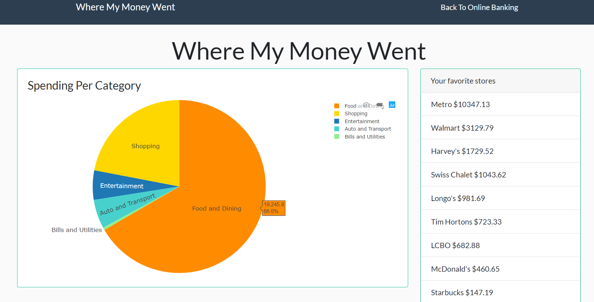
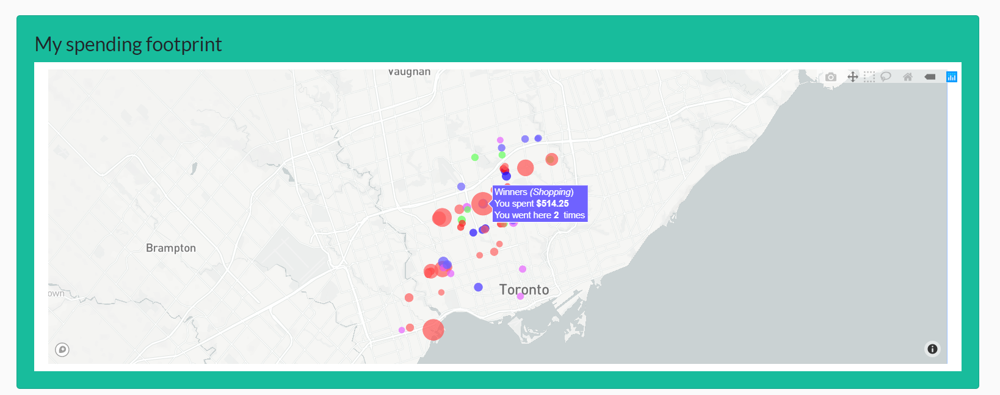
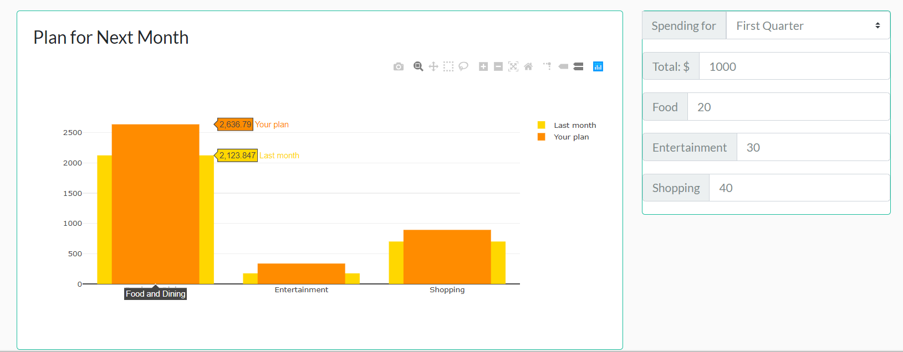

# BOLT2019

## Spending by category
The pie chart displays how much the user has spent on each category. 

"Your favorite stores" ranks merchants in one category in order of amount.

## Spending footprint
The map shows where the user's money went. 
* Larger size: larger amount 
* Darker color: higher frequency

## Comparision and planning
The bar chart shows last month's spending per category. After the user created a spending plan, the bar chart will show the new plan based on the inputs. To get more accurate results, the outputs are calculated based on the user's spending for the last three months.
Unfortunately, the callback for changes in the spending plan is unimplemented due to time limits.

